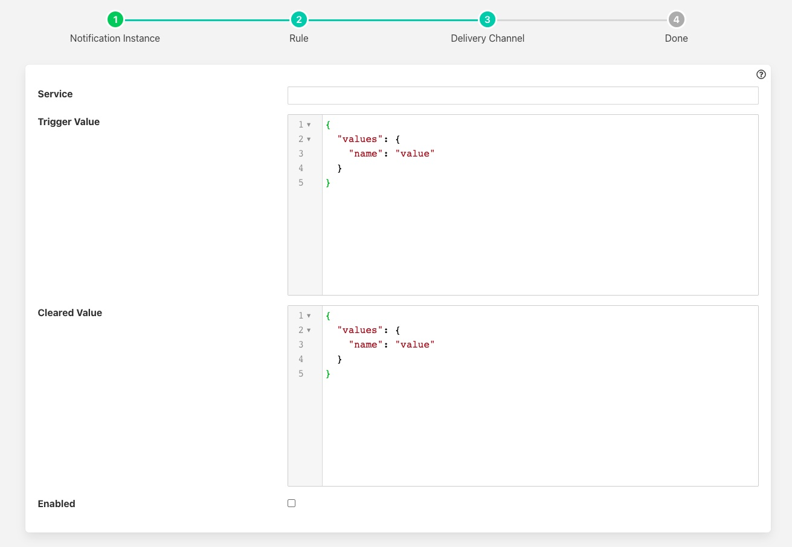

.. Images

Set Point Control Notification
==============================

The *fledge-notify-setpoint* notification delivery plugin is a mechanism by which a notification can be used to send set point control writes into south services which support set point control

Once you have created your notification rule and move on to the delivery mechanism

  - Select the setpoint plugin from the list of plugins

  - Click *Next*

    +--------------+
    | |setpoint_1| |
    +--------------+

  - Configure the plugin

    - **Service**: The name of the south service you wish to control

    - **Trigger Value**: The set point control payload to send to the south service. This is a list of name, value pairs to be set within the service. These are set when the notification rule triggers.

    - **Cleared Value**: The set point control payload to send to the south service. This is a list of name, value pairs to be set within the service. There are set when the notification rule clears.

  - Enable the plugin and click *Next*

  - Complete your notification setup

Trigger Values
--------------

The *Trigger Value* and *Cleared Value* are JSON documents that are sent to the set point entry point of the south service. The format of these is a set of name and value pairs that represent the data to write via the south service. A simple example would be as below

.. code-block:: JSON

   {
       "values": {
          "temperature" : "11",
          "rate"        : "245"
       }
   }

In this example we are setting two variables in the south service, one named *temperature* and the other named *rate*. In this example the values are constants defined in the plugin configuration. It is possible however to use values that are in the data that triggered the notification.

As an example of this assume we are controlling the speed of a fan based on the temperature of an item of equipment. We have a south service that is reading the temperature of the equipment, let's assume this is in an asset called *equipment* which has a data point called *temperature*. We add a filter using the *fledge-filter-expression* filter to calculate a desired fan speed. The expression we will use in this example is *desiredSpeed = temperature * 100*. This will case the asset to have a second data point called *desiredSpeed*.

We create a notification that is triggered if the *desiredSpeed* is greater than 0. The delivery mechanism will be this plugin, *fledge-notify-setpoint*. We want to set two values in the south plugin *speed* to set the speed of the fan and *run* which controls if the fan is on or off. We set the *Trigger Value* to the following

.. code-block:: JSON

   {
       "values" : {
            "speed" : "$equipment.desiredSpeed$",
            "run"   : "1"
       }
    }

In this case the *speed* value will be substituted by the value of the *desiredSpeed* data point of the *equipment* asset that triggered the notification to be sent.
